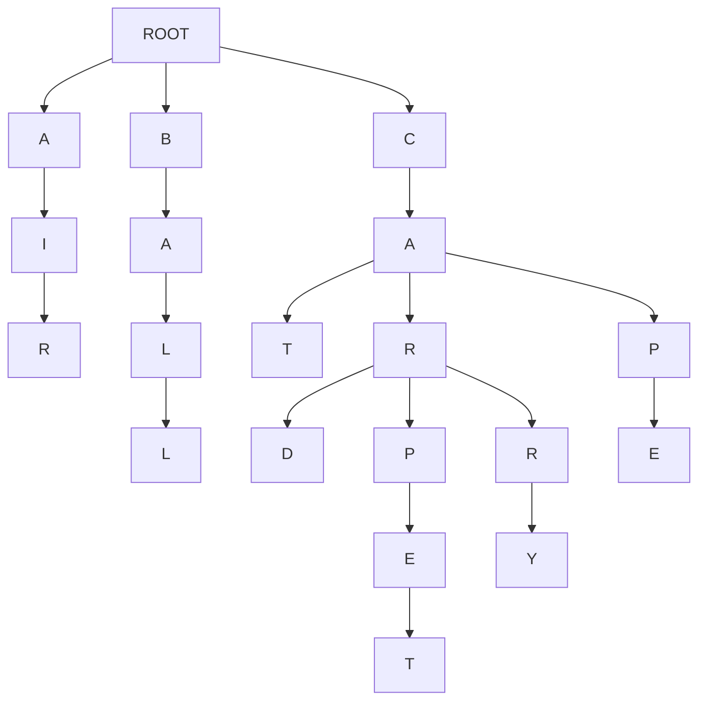

[](https://classroom.github.com/a/UBg156UM)
# Assignment 2 - SearchComplete

## Assignment Objectives

1) Learn how to implement search algorithms in python
2) Learn how search algorithms can be used in practical application
3) Learning the differences between BFS, DFS, and UCS via implementation
4) Analyze the differences between search algorithms by comparing outputs
5) Learning how to build a search tree from textual data
6) Build a basic autocomplete feature that suggests words as the user types, using different search strategies.
7) Analyze how each algorithm affects the order and quality of suggestions, and learn when to choose each one.

## Pre-Requisites

- **Basic Python:** Familiarity with Python syntax, data structures (lists, dictionaries, queues), and basic algorithms.
- **Search Algorithms:** Theoretical understanding of BFS, DFS, and UCS
- **Tree:** Prior knowledge of Tree data structures is helpful.
- **Data Structures:** High level understanding of Data Structures like Stacks, Queues, and Priority Queues is required.

## Overview
Imagine you're an intern at a cutting-edge tech company called "WordWizard." Your first task: upgrade their revolutionary messaging app, "ChatCast," to include a mind-blowing autocomplete feature. The goal is simple – as users type, the app magically suggests the words they might be looking for, making conversations faster and more fun!

But here's the twist: Your quirky, genius boss, Dr. Lexico, insists on using classic search algorithms to power this futuristic feature. "Forget fancy neural networks," she exclaims. "Let's prove that good old BFS, DFS, and UCS can still deliver the goods!"

So, you're handed a massive dictionary of Gen Z slang and challenged to build the autocomplete engine. Can you master the algorithms, construct a word-filled tree, and unleash the power of search to create an autocomplete experience that will make even the most texting-savvy teen say, "OMG, this is lit!"?

The future of "ChatCast" (and your internship) depends on it. Time to dive into the code and become a word-suggesting wizard! 

## Lab Description

1. **First step**
    - Clone the repo and run `main.py`
      ```bash
      python main.py
      ```
    - If you're on linux/mac and the former doesn't work for you
      ```bash
      python3 main.py
      ```
      
      
2.  **Explore the Starter Code:**
    - Review the provided `Autocomplete` class. It handles building the tree from a text document, setting up a basic user interface, and providing a framework for the `suggest` method.
3.  **Implement Search Algorithms:**
    - Your main task is to complete the `suggest` methods. These methods should take a prefix as input and return a list of word suggestions. 
    - You'll implement multiple versions of `suggest`:
        - `suggest_bfs`: Breadth-First Search
        - `suggest_dfs`: Depth-First Search
        - `suggest_ucs`: Uniform-Cost Search  


## Background: Autocomplete as a Search Problem

Alright! Let's give you some context before you get into the weeds of the starter code. 
Autocomplete might seem like some complicated magic, but at its core, it's just an application of search algorithms on a tree (that's how it's done in this assignment for your simplicity, but it's done very differently in real word). Let's break down how this works:

**The Search Space: A Tree of Characters**

To implement the autocomplete feature, you would build a tree of characters, which will be the search space for this search problem. 
In your starter code, you're given a `document` (a `txt` file) of several words. 
Imagine each word in your document is broken down into its individual letters. Now, picture these letters arranged in a single tree-like structure, for example look at the tree diagram below:


**Tree Diagram**

For example, let the document that is given to you be - 

```txt
air ball cat car card carpet carry cap cape
```




Above is a diagram of the tree that is build from the example `document` given above. Note how the *tree* starts with a common `root` 

- This is what the search space for your search problem would look like. 
- You will traverse the *tree* starting from the last node of the prefix that the user enters to generate autocomplete suggestions. 

**The Search Problem**

When a user types a prefix (e.g., "ca"), the autocomplete feature needs to find all the words in the *tree* that start with that prefix. This translates to a search problem:

- **Initial state:** The node representing the last letter of the prefix ("a" in our example).
- **Action** - a transition between one letter to the next letter in the *tree*
- **Goal:** The end of the word(s) (that start with the given prefix) in the *tree*. <u>Note how there could be multiple goals in this problem.</u>
- **Path:** The sequence of characters from the root to a goal node represents a complete word.

**Search Algorithms**

We can employ various search algorithms to traverse this *tree* and find our goal nodes (complete words).

- **Breadth-First Search (BFS):**  Explores the *tree* level-by-level, ensuring we find the shortest words first. 
- **Depth-First Search (DFS):** Dives deep into the *tree*, potentially finding longer, less common words first.
- **Uniform-Cost Search (UCS):** Considers the frequency of each character transition to prioritize more likely words based on the prefix.

**Multiple Goals and Paths**

In autocomplete, we're not just looking for a single goal node. We want to find *all* the goal nodes (words) that follow from the prefix. Furthermore, we're interested in the entire path from the root to each goal node, as this path represents the complete suggested word.

**Your Task:**

Your task is to implement BFS, DFS, and UCS to traverse the *tree* and generate autocomplete suggestions. You'll see how different algorithms affect the order and type of words suggested, and understand the trade-offs involved in choosing one over the other.


## Starter Code
For the starter code you have been given 3 files - 
1. **`autocomplete.py`** - This is where all your code that you write will go.
2. **`main.py`** - This file is responsible to setting up and running the autocomplete feature. Modifying this file is optional. Feel free to use this file for debugging or playing around with the autocomplete feature.
3. **`utilities.py`** - This file contains the code to read the document provided and building the Graphical User Interface for the autocomplete feature. This file is not related to the core logic of the autocomplete feature. Please do not modify this file.

### `autocomplete.py`
- This file has a `Node` class defined for you - 
    - Each Node represents a single character within a word. The `Node class has 1 attribute - 
        1. `children` - This is a dictionary that stores - 
            - Keys - Characters that which follow the current character in a word.
            - Values - `Node` objects, representing the next character in the sequence. 
    **You might (most likely will) want the `Node` class keep track of more things depending on how you implement you `suggest` methods.**

- The file also has an `autocomplete` class defined for you - 
    - The Engine Behind the Suggestions
    - **Attributes**
        - `root`: A root node of the tree. The tree stores all the words of the document in a tree structure, where each `Node` is character.
    - **Methods**
        - `__init__(document="")`:
            - Initializes an empty tree (the `root` node).
            - If a `document` string is provided, it builds the tree from that document.
            - document is a space separated textfile, example below.
            - ```txt
              air ball cat car card carpet carry cap cape
              ``` 
        - `build_tree(document)` #TODO:
            - As the name of the function suggests, takes a text string `document` and builds a tree of words, where each `Node` is a character. 
            - The implementation of this method has been left up to you.

## **Student Tasks:**
The main goal of the lab activity is for students to implement the `build_tree`, `suggest_bfs`, `suggest_ucs`, and `suggest_dfs` methods. 


### 0. TODO: Intuition of the code written
- For all code that you will write for this assignment (which is not a lot), you must provide a brief intuition (1-2 sentences) of the major control structures of your code in the reports section at the bottom of this readme.
- You are not being asked to write a story, keep it concise and precise (remember, 1-2 sentences, at most 3).

**Consider the `fizz-buzz` code given below:**

```python
def fizzbuzz(n):
    for i in range(1, n + 1):
        if i % 15 == 0:
            print("FizzBuzz")
        elif i % 3 == 0:
            print("Fizz")
        elif i % 5 == 0:
            print("Buzz")
        else:
            print(i)

```

**Now this is what you're explanation should (somewhat) look like -**

<u>Iterates through a range of numbers n printing that number unless the number is a multiple of 3 or 5 where instead "Fizz" or "Buzz" is printed respectively. "FizzBuzz" is printed if the number is a multiple of both 3 and 5.</u>


### 1. TODO: `build_tree(document)`

>[!NOTE]
>**TODO: Draw the tree diagram of test.txt given in the starter code**
    - Upload the image into your `readme` into the reports section in the end of this readme.


**What it does:**

- Takes a text `document` as input.
- Splits the document into individual words.
- Inserts each word into a tree (prefix tree) data structure.
- Each character of a word becomes a node in the tree.

**Your task:**

- Complete the `for` loop within the `build_tree` method.


### 2. TODO: `suggest_bfs(prefix)`

**What it does:**

- Implements the Breadth-First Search (BFS) algorithm on the tree.
- Takes a `prefix` (the letters the user has typed so far) as input.
- Finds all words in the tree that start with the `prefix`.

**Your task:**
- Start from the node that corresponds to the last character of the `prefix`.
- Using BFS traverse the sub tree and build a list of suggestions.
- **Run your code with the `genZ.txt` file and `suggest_bfs()` method that you just implemented with the prefix `"th"` and note the the autocompleted suggestions it generates in the *Reports Section* below. Make sure you note down the suggestions in the same order in which they are originally displayed on your screen.**

### 3. TODO: `suggest_dfs(prefix)`

**What it does:**

- Implements the Depth-First Search (DFS) algorithm on the tree.
- Takes a `prefix` as input.
- Finds all words in the tree that start with the `prefix`.

**Your task:**
- Start from the node that corresponds to the last character of the `prefix`.
- Using DFS traverse the sub tree and build a list of suggestions.
- **Explain your intuition in recursive DFS VS stack-based DFS, and which one you used. Write this in the section provided at the end of this readme.**
- **Run your code with the `genZ.txt` file and `suggest_dfs()` method that you just implemented with the prefix `"th"` and note the the autocompleted suggestions it generates in the *Reports Section* below. Make sure you note down the suggestions in the same order in which they are originally displayed on your screen.**

### 4. TODO: `suggest_ucs(prefix)`

**What it does:**

- Implements the Uniform Cost Search (UCS) algorithm on the tree.
- Takes a `prefix` as input.
- Finds all words in the tree that start with the `prefix`.
- Prioritizes suggestions based on the frequency of characters appearing after previous characters.

**Your task:**

- Update `build_tree()` to store the path cost. The path cost is the inverse frequencies of that letter/char following that prefix of characters.
    - Using the inverse of these frequencies creates a lower path cost for more frequent character sequences.    
- Start from the node that corresponds to the last character of the `prefix`.
- Using UCS traverse the sub tree and build a list of suggestions.
- **Run your code with the `genZ.txt` file and `suggest_ucs()` method that you just implemented with the prefix `"th"` and note the the autocompleted suggestions it generates in the *Reports Section* below. Make sure you note down the suggestions in the same order in which they are originally displayed on your screen.**

<br>

>[!NOTE]
>This is not optional
> Try experimenting with different approaches and compare the results! Try typing different prefixes in the GUI and observe how the suggested words change depending on which search algorithm you're using. This will help you gain a deeper understanding of their strengths and weaknesses.<br>
> **Note down these observations in the reports section provided at the end of this readme**

## What to Submit

1.  **Completed `autocomplete.py` file:**  Containing your implementations of the `build_tree`, `suggest_bfs`, `suggest_dfs`, and `suggest_ucs` methods.
2.  **Completed _Reports Section_ at the botton of the `readme.md` file:** Briefly explaining wherever necessary, and completing the required tasks in the *Reports Section*. 

## Rubric

| Criteria                        | Points (Example) |
| -------------------------------- | ----------- |
| Diagram and explaination for `build_tree` | 10% |
| Correctness of `build_tree`      | 10%         |
| Explanation of `build_tree`      | 10%         |
| Correctness of `suggest_bfs`     | 10%         |
| Explanation of `suggest_bfs`     | 10%         |
| Correctness of `suggest_dfs`     | 10%         |
| Explanation of `suggest_dfs`     | 10%         |
| Correctness of `suggest_ucs`     | 10%         |
| Explanation of `suggest_ucs`     | 10%         |
| Experimentation                  | 10 %        |

<hr>
<br>
<br>


# A Reports section

## 383GPT
Did you use 383GPT at all for this assignment (yes/no)?

## `build_tree`

### Tree diagram
- Put the tree diagram for `test.txt` here


### Code analysis

- The goal was to be able to construct a tree like the one I drew out for test.txt. There are 3 main aspects to look at for my implementation of this method:
- need to consider the scenario that we are encountering the character/letter of said word for the first time (i.e there is no node that exists of it yet) and thus put it as a child of the parent (whom we are we currently traversing through)
- need to consider that we are on a different character for a different word but are at a already constructed node of the tree; in which case we simpley move to the next
- we need to consider for the words that are exact substrings of other words in the document (it can be easy to overlook them during the search and just follow the tree path all the way to the leaf node when another word may have ended earlier already); thus I added an attribute to node to mark it as seen if it was part of a complete word

### Your output

- Put the output you got for the prefixes provided here: this is N/A since it is only the build_tree function

## `BFS`

### Code analysis

- since prefix is given, we already have some idea of what will be included; searching must start from the last known char in the prefix - to find this we traverse the tree in the prefix's character chronology and find the last char - this is where the bfs or rather, any searching will start from
- whilst performing bfs, we need to keep track of all the neighbors in an "adjacency list", to do so a double ended queue (deque) data structure has been used since it obeys the FIFO process where whatever was added to the list first is popped first and looked at - everytime a full word is encountered while traversing it is added to the suggestions array
- best part of using bfs is finds the shortest words first since every level is explored before moving to the next

### Your output

- 

## `DFS`

### Code analysis

- Very similar intuition to BFS especially starting the search from the last char and adding words matched to suggestions array, continuing search for each child and char encountered traversing the tree whilst traversing tree
- main difference from bfs is using recursion to perform search since certain paths down tree are traversed before others
- leads to finding longer maybe less uncommon words due to whichever path the search "dove" into

### Your output

- 

### Recursive DFS vs Stack-based DFS
- I used recursive based dfs in this implementation. This is because I was trying to follow software solid design principles by trying to keep the code more natural flowing by using a recursive call stack instead of a user-defined one as I find that it was much more shortly and neatly written. While iterative dfs would have been "faster", I prioritised readibility, feasibility and wanted to explore a search algorithm without a data structure unlike the other two. Natrually, this was the only serch method to work within my first draft of the code since it was so easy to follow and write.

## `UCS`

### Code analysis

- this was more different from dfs/bfs but search started from last char of prefix as others
- the focus of this method was using the cost properly for ucs which was calculated as 1/(freq of char in that position for words); this was calculated by tracking frequency as an attribute in the node instantiation itself and updating the frequency dictionary for the nodes by incrementing the values of the child chars everytime one was encountered
- min heap or priority queue data structure was used for this search as it still obeyed the FIFO process which is needed but we need to find the path on the tree with the lowest cost i.e the min priority from the heap

### Your output

- 

## Experimental
- Explain here what differences did you see in the suggestions generated when you used BFS vs DFS vs UCS. 

I learned that the searches worked quite similarly, more so than I thought. Moreover, when using the gui, it was hard to determine which search was being used at that time without already knowing. However, I do think that bfs worked well in terms of displaying shorter, simpler words first which follows quite logically when autocompleting. DFS was also similar but a little less logically flowing since certain big, uncommon words would appear first and woudn't necessarily make sense in a recommendation system based on logic or priority. I did think the UCS search was the most user-experience based since it catered to usibility  more than anything else and used additional metrics like how frequent certain characters appeared in positions in different words which made it the most suitable as not a autocomplete form but also in reocmmending words based on what the user would be more likely to type, hypothetically. Overall, I can see lots of changes in preferred search algorithm based on the use case or what the product's priority is in terms of its users.


