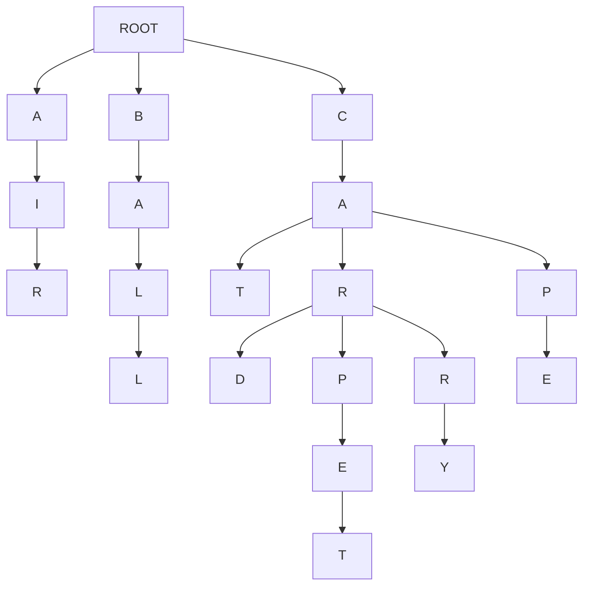

[](https://classroom.github.com/a/UBg156UM)
# Assignment 2 - SearchComplete

## Assignment Objectives

1) Learn how to implement search algorithms in python
2) Learn how search algorithms can be used in practical application
3) Learning the differences between BFS, DFS, and UCS via implementation
4) Analyze the differences between search algorithms by comparing outputs
5) Learning how to build a search tree from textual data
6) Build a basic autocomplete feature that suggests words as the user types, using different search strategies.
7) Analyze how each algorithm affects the order and quality of suggestions, and learn when to choose each one.

## Pre-Requisites

- **Basic Python:** Familiarity with Python syntax, data structures (lists, dictionaries, queues), and basic algorithms.
- **Search Algorithms:** Theoretical understanding of BFS, DFS, and UCS
- **Tree:** Prior knowledge of Tree data structures is helpful.
- **Data Structures:** High level understanding of Data Structures like Stacks, Queues, and Priority Queues is required.

## Overview
Imagine you're an intern at a cutting-edge tech company called "WordWizard." Your first task: upgrade their revolutionary messaging app, "ChatCast," to include a mind-blowing autocomplete feature. The goal is simple – as users type, the app magically suggests the words they might be looking for, making conversations faster and more fun!

But here's the twist: Your quirky, genius boss, Dr. Lexico, insists on using classic search algorithms to power this futuristic feature. "Forget fancy neural networks," she exclaims. "Let's prove that good old BFS, DFS, and UCS can still deliver the goods!"

So, you're handed a massive dictionary of Gen Z slang and challenged to build the autocomplete engine. Can you master the algorithms, construct a word-filled tree, and unleash the power of search to create an autocomplete experience that will make even the most texting-savvy teen say, "OMG, this is lit!"?

The future of "ChatCast" (and your internship) depends on it. Time to dive into the code and become a word-suggesting wizard! 

## Lab Description

1. **First step**
    - Clone the repo and run `main.py`
      ```bash
      python main.py
      ```
    - If you're on linux/mac and the former doesn't work for you
      ```bash
      python3 main.py
      ```
      
      
2.  **Explore the Starter Code:**
    - Review the provided `Autocomplete` class. It handles building the tree from a text document, setting up a basic user interface, and providing a framework for the `suggest` method.
3.  **Implement Search Algorithms:**
    - Your main task is to complete the `suggest` methods. These methods should take a prefix as input and return a list of word suggestions. 
    - You'll implement multiple versions of `suggest`:
        - `suggest_bfs`: Breadth-First Search
        - `suggest_dfs`: Depth-First Search
        - `suggest_ucs`: Uniform-Cost Search  


## Background: Autocomplete as a Search Problem

Alright! Let's give you some context before you get into the weeds of the starter code. 
Autocomplete might seem like some complicated magic, but at its core, it's just an application of search algorithms on a tree (that's how it's done in this assignment for your simplicity, but it's done very differently in real word). Let's break down how this works:

**The Search Space: A Tree of Characters**

To implement the autocomplete feature, you would build a tree of characters, which will be the search space for this search problem. 
In your starter code, you're given a `document` (a `txt` file) of several words. 
Imagine each word in your document is broken down into its individual letters. Now, picture these letters arranged in a single tree-like structure, for example look at the tree diagram below:


**Tree Diagram**

For example, let the document that is given to you be - 

```txt
air ball cat car card carpet carry cap cape
```




Above is a diagram of the tree that is build from the example `document` given above. Note how the *tree* starts with a common `root` 

- This is what the search space for your search problem would look like. 
- You will traverse the *tree* starting from the last node of the prefix that the user enters to generate autocomplete suggestions. 

**The Search Problem**

When a user types a prefix (e.g., "ca"), the autocomplete feature needs to find all the words in the *tree* that start with that prefix. This translates to a search problem:

- **Initial state:** The node representing the last letter of the prefix ("a" in our example).
- **Action** - a transition between one letter to the next letter in the *tree*
- **Goal:** The end of the word(s) (that start with the given prefix) in the *tree*. <u>Note how there could be multiple goals in this problem.</u>
- **Path:** The sequence of characters from the root to a goal node represents a complete word.

**Search Algorithms**

We can employ various search algorithms to traverse this *tree* and find our goal nodes (complete words).

- **Breadth-First Search (BFS):**  Explores the *tree* level-by-level, ensuring we find the shortest words first. 
- **Depth-First Search (DFS):** Dives deep into the *tree*, potentially finding longer, less common words first.
- **Uniform-Cost Search (UCS):** Considers the frequency of each character transition to prioritize more likely words based on the prefix.

**Multiple Goals and Paths**

In autocomplete, we're not just looking for a single goal node. We want to find *all* the goal nodes (words) that follow from the prefix. Furthermore, we're interested in the entire path from the root to each goal node, as this path represents the complete suggested word.

**Your Task:**

Your task is to implement BFS, DFS, and UCS to traverse the *tree* and generate autocomplete suggestions. You'll see how different algorithms affect the order and type of words suggested, and understand the trade-offs involved in choosing one over the other.


## Starter Code
For the starter code you have been given 3 files - 
1. **`autocomplete.py`** - This is where all your code that you write will go.
2. **`main.py`** - This file is responsible to setting up and running the autocomplete feature. Modifying this file is optional. Feel free to use this file for debugging or playing around with the autocomplete feature.
3. **`utilities.py`** - This file contains the code to read the document provided and building the Graphical User Interface for the autocomplete feature. This file is not related to the core logic of the autocomplete feature. Please do not modify this file.

### `autocomplete.py`
- This file has a `Node` class defined for you - 
    - Each Node represents a single character within a word. The `Node class has 1 attribute - 
        1. `children` - This is a dictionary that stores - 
            - Keys - Characters that which follow the current character in a word.
            - Values - `Node` objects, representing the next character in the sequence. 
    **You might (most likely will) want the `Node` class keep track of more things depending on how you implement you `suggest` methods.**

- The file also has an `autocomplete` class defined for you - 
    - The Engine Behind the Suggestions
    - **Attributes**
        - `root`: A root node of the tree. The tree stores all the words of the document in a tree structure, where each `Node` is character.
    - **Methods**
        - `__init__(document="")`:
            - Initializes an empty tree (the `root` node).
            - If a `document` string is provided, it builds the tree from that document.
            - document is a space separated textfile, example below.
            - ```txt
              air ball cat car card carpet carry cap cape
              ``` 
        - `build_tree(document)` #TODO:
            - As the name of the function suggests, takes a text string `document` and builds a tree of words, where each `Node` is a character. 
            - The implementationn of this method has been left up to you.

## **Student Tasks:**
The main goal of the lab activity is for students to implement the `build_tree`, `suggest_bfs`, `suggest_ucs`, and `suggest_dfs` methods. 


### 0. TODO: Intuition of the code written
- For all code that you will write for this assignment (which is not a lot), you must provide a breif intuition (1-2 sentences) of the major control structures of your code in the reports section at the bottom of this readme.
- You are not being asked to write a story, keep it concise and precise (remember, 1-2 sentences, at most 3).

**Consider the `fizz-buzz` code given below:**

```python
def fizzbuzz(n):
    for i in range(1, n + 1):
        if i % 15 == 0:
            print("FizzBuzz")
        elif i % 3 == 0:
            print("Fizz")
        elif i % 5 == 0:
            print("Buzz")
        else:
            print(i)

```

**Now this is what you're explaination should (somewhat) look like -**

<u>Iterates through a range of numbers n printing that number unless the number is a multiple of 3 or 5 where instead "Fizz" or "Buzz" is printed respectively. "FizzBuzz" is printed if the number is a multiple of both 3 and 5.</u>


### 1. TODO: `build_tree(document)`

>[!NOTE]
>**TODO: Draw the tree diagram of test.txt given in the starter code**
    - Upload the image into your `readme` into the reports section in the end of this readme.


**What it does:**

- Takes a text `document` as input.
- Splits the document into individual words.
- Inserts each word into a tree (prefix tree) data structure.
- Each character of a word becomes a node in the tree.

**Your task:**

- Complete the `for` loop within the `build_tree` method.


### 2. TODO: `suggest_bfs(prefix)`

**What it does:**

- Implements the Breadth-First Search (BFS) algorithm on the tree.
- Takes a `prefix` (the letters the user has typed so far) as input.
- Finds all words in the tree that start with the `prefix`.

**Your task:**
- Start from the node that corresponds to the last character of the `prefix`.
- Using BFS traverse the sub tree and build a list of suggestions.
- **Run your code with the `genZ.txt` file and `suggest_bfs()` method that you just implemented with the prefix `"th"` and note the the autocompleted suggestions it generates in the *Reports Section* below. Make sure you note down the suggestions in the same order in which they are originally displayed on your screen.**

### 3. TODO: `suggest_dfs(prefix)`

**What it does:**

- Implements the Depth-First Search (DFS) algorithm on the tree.
- Takes a `prefix` as input.
- Finds all words in the tree that start with the `prefix`.

**Your task:**
- Start from the node that corresponds to the last character of the `prefix`.
- Using DFS traverse the sub tree and build a list of suggestions.
- **Explain your intuition in recursive DFS VS stack-based DFS, and which one you used. Write this in the section provided at the end of this readme.**
- **Run your code with the `genZ.txt` file and `suggest_dfs()` method that you just implemented with the prefix `"th"` and note the the autocompleted suggestions it generates in the *Reports Section* below. Make sure you note down the suggestions in the same order in which they are originally displayed on your screen.**

### 4. TODO: `suggest_ucs(prefix)`

**What it does:**

- Implements the Uniform Cost Search (UCS) algorithm on the tree.
- Takes a `prefix` as input.
- Finds all words in the tree that start with the `prefix`.
- Prioritizes suggestions based on the frequency of characters appearing after previous characters.

**Your task:**

- Update `build_tree()` to store the path cost. The path cost is the inverse frequencies of that letter/char following that prefix of characters.
    - Using the inverse of these frequencies creates a lower path cost for more frequent character sequences.    
- Start from the node that corresponds to the last character of the `prefix`.
- Using UCS traverse the sub tree and build a list of suggestions.
- **Run your code with the `genZ.txt` file and `suggest_ucs()` method that you just implemented with the prefix `"th"` and note the the autocompleted suggestions it generates in the *Reports Section* below. Make sure you note down the suggestions in the same order in which they are originally displayed on your screen.**

<br>

>[!NOTE]
>This is not optional
> Try experimenting with different approaches and compare the results! Try typing different prefixes in the GUI and observe how the suggested words change depending on which search algorithm you're using. This will help you gain a deeper understanding of their strengths and weaknesses.<br>
> **Note down these observations in the reports section provided at the end of this readme**


## What to Submit

1.  **Completed `autocomplete.py` file:**  Containing your implementations of the `build_tree`, `suggest_bfs`, `suggest_dfs`, and `suggest_ucs` methods.
2.  **Completed _Reports Section_ at the botton of the `readme.md` file:** Briefly explaining wherever necessary, and completing the required tasks in the *Reports Section*. 

## Rubric

| Criteria                        | Points (Example) |
| -------------------------------- | ----------- |
| Diagram and explaination for `build_tree` | 10% |
| Correctness of `build_tree`      | 10%         |
| Explaination of `build_tree`      | 10%         |
| Correctness of `suggest_bfs`     | 10%         |
| Explaination of `suggest_bfs`     | 10%         |
| Correctness of `suggest_dfs`     | 10%         |
| Explaination of `suggest_dfs`     | 10%         |
| Correctness of `suggest_ucs`     | 10%         |
| Explaination of `suggest_ucs`     | 10%         |
| Experimention                     | 10 %        |

<hr>
<br>
<br>


# A Reports section

## 383GPT
Did you use 383GPT at all for this assignment (yes/no)?
yes

## `build_tree`
The `build_tree` function constructs a tree from the input `document` by iterating through each word and character, creating nodes for any missing characters, and updating character frequency counts to facilitate efficient word search and autocomplete functionality.

### Tree diagram
- Put the tree diagram for `test.txt` here
- 


### Code analysis

The intuition behind the `build_tree` function is to create a trie (prefix tree) that efficiently stores a collection of words from a given document. This structure allows for fast retrieval operations, such as checking if a word exists or finding all words that share a common prefix.
Tree Structure: The tree is built by adding nodes for each character of every word. Each character in a word corresponds to a node in the tree, and words that share common prefixes will have overlapping paths in this tree-like structure.
Node Creation: For each character in a word, if the corresponding child node does not exist, a new node is created. This ensures that each unique character is properly represented in the tree.
Tracking End of Words: The `ending` attribute in the node signals that a complete word ends at that node, allowing for easy identification of complete words in the trie.

### Your output


## `BFS`

### Code analysis

The `suggest_bfs` function provides a mechanism for retrieving word suggestions from a trie based on a given prefix using a breadth-first search (BFS) approach. This function is essential for implementing features like autocomplete, where users receive suggestions that start with a specified sequence of characters.
Finding the Prefix Node: The function begins by traversing the trie to locate the node that corresponds to the last character of the provided prefix. If any character in the prefix is not found in the current node's children, it indicates that there are no words that match that prefix, and an empty list is returned.
BFS Traversal: Once the correct node is located, the function initiates a BFS from that node. It uses a queue to explore all descendant nodes. Each node is examined, and if it indicates the end of a word (via the `ending` attribute), the complete word is constructed using the `_collect_chars` helper method and added to the suggestions list.
Character Collection: The `_collect_chars` method is utilized to backtrack from the current node to the root, collecting characters to form complete words. It appends characters to a list and reverses the list at the end to ensure that the characters are in the correct order, as they were collected from leaf to root.
Summary
In summary, the `suggest_bfs` function efficiently finds and suggests all words in a trie that start with a specified prefix by first locating the prefix node and then performing a BFS to gather all complete words from that node. The helper method `_collect_chars` ensures that we can accurately construct words from the character nodes, providing users with relevant suggestions in an efficient manner. Together, these functions facilitate a seamless and responsive autocomplete experience in applications that require word suggestions based on user input.

### Your output


## `DFS`

### Code analysis

The `suggest_dfs` function is designed to generate word suggestions from a trie using a depth-first search (DFS) approach based on a given prefix. This is particularly useful in applications requiring efficient autocompletion or word suggestion features.
Finding the Prefix Node: The function starts by navigating through the trie to find the node that corresponds to the last character of the provided prefix. If any character in the prefix does not exist in the current node’s children, it indicates that no words can be formed with that prefix, and an empty list is returned.
DFS for Suggestions: After locating the prefix node, the function initializes an empty list to hold the suggestions and calls the recursive helper function `_dfs_helper`. This function explores all child nodes (i.e., characters) of the current node in a depth-first manner.
Recursive Character Collection: The `_dfs_helper` method works recursively. For each child node, it appends the current character to the accumulated `current_word` and proceeds to explore its children. When a node is reached that marks the end of a valid word (indicated by the `ending` attribute), the function combines the `current_word` with the character of that node to form a complete word, which is then added to the suggestions list.
Summary
In summary, the `suggest_dfs` function leverages depth-first search to efficiently collect and return all valid word suggestions that start with a given prefix from a trie. It initiates the search after confirming the presence of the prefix and then utilizes a recursive helper function to traverse the trie, building complete words as it identifies valid end nodes. This approach provides a flexible and efficient mechanism for retrieving word suggestions based on user input, enhancing the user experience in applications where autocomplete functionality is desirable.

### Your output


### Recursive DFS vs Stack-based DFS
-Recursive DFS
Intuition:
- Recursive DFS leverages the call stack of the programming language to keep track of the nodes that need to be visited. Each recursive call represents a branching point in the tree, allowing the function to naturally explore down paths without explicitly managing a data structure to hold the state of the traversal.
- It is often cleaner and simpler to implement because the recursive calls can be easier to read and maintain. Each call inherently captures the current node and its context (e.g., the path taken so far).

Stack-based DFS
Intuition:
- Stack-based DFS uses an explicit stack data structure to manage the nodes to be explored. This approach simulates the call stack managed by the system in the recursive version but allows for better control over the traversal process.
- It requires more boilerplate code since you have to manage the stack manually and handle the state of each node you visit.

In the implementation you provided (i.e., the `suggest_dfs` function), a recursive DFS approach is used. The method relies on recursive function calls to explore the trie, where each call to the helper function (`_dfs_helper`) dives deeper into the tree structure. This method effectively allows for building a path of characters to construct complete words while automatically following the natural flow of traversing child nodes.
This choice of recursion is particularly suitable for this application as it enhances readability and aligns well with the task of exploring a tree-like data structure. It simplifies the code needed to build word suggestions based on a prefix, making it easier to understand and maintain. However, keep in mind the potential limitations regarding depth in scenarios with very large tries.

## `UCS`

### Code analysis

`ucs(self, node, prefix, suggestions)`:
- This recursive helper function traverses the trie from a given `node`.
- If the current `node` represents the end of a word (indicated by the `ending` attribute), the current `prefix` (which represents a completed word) is added to the `suggestions` list.
- The function then iterates over each child node of the current node. For each child, it recursively calls itself (`ucs`), appending the child's character to the `prefix`. This effectively builds all possible word completions from the given prefix up to the end of the subtree.
`suggest_ucs(self, prefix)`:
- This function serves as the entry point for generating suggestions based on a provided `prefix`.
- First, it attempts to locate the node in the trie that corresponds to the end of the provided prefix. If any character of the prefix is not found in the current node's children, the function immediately returns an empty list of suggestions.
- Once the appropriate node is found, it calls the `ucs` method to explore all child nodes of the found prefix node and generate suggestions.
Logic Summary
The overall logic of this implementation is centered around exploring a trie for word suggestions that match a given prefix.
Starting from the root of the trie, the `suggest_ucs` method navigates down to the node that corresponds to the last character of the prefix. If the prefix is incomplete or invalid (i.e., not found in the trie), it returns an empty list signifying no suggestions.
After successfully locating the prefix node, the `ucs` function is invoked. This function will explore all possible paths (child nodes) from that node recursively, constructing complete words by appending characters to the prefix and checking if each resulting word is valid (ends at an `ending` node).
The design reflects a depth-first traversal approach, similar to DFS, to gather all word completions associated with the specified prefix.

### Your output


## Experimental
BFS always gave in alphabetical order
UCS always gave the one with the most third char in a row. 
Dfs gave a mixture of everything


