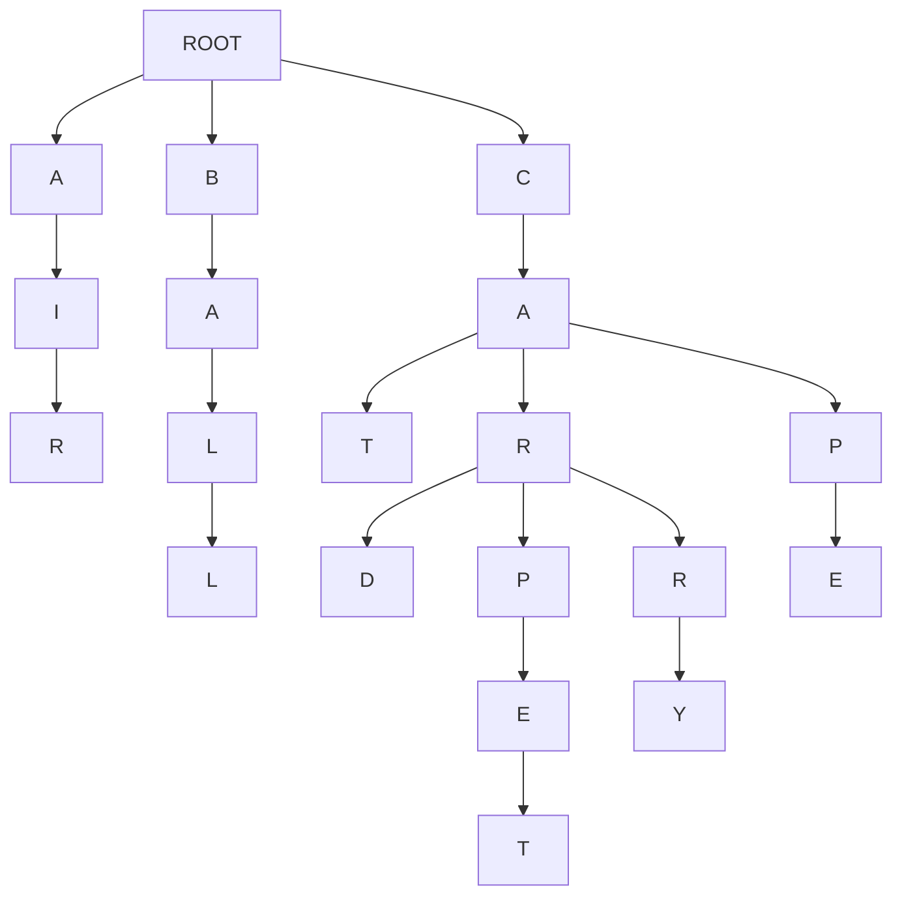

[](https://classroom.github.com/a/UBg156UM)
# Assignment 2 - SearchComplete

## Assignment Objectives

1) Learn how to implement search algorithms in python
2) Learn how search algorithms can be used in practical application
3) Learning the differences between BFS, DFS, and UCS via implementation
4) Analyze the differences between search algorithms by comparing outputs
5) Learning how to build a search tree from textual data
6) Build a basic autocomplete feature that suggests words as the user types, using different search strategies.
7) Analyze how each algorithm affects the order and quality of suggestions, and learn when to choose each one.

## Pre-Requisites

- **Basic Python:** Familiarity with Python syntax, data structures (lists, dictionaries, queues), and basic algorithms.
- **Search Algorithms:** Theoretical understanding of BFS, DFS, and UCS
- **Tree:** Prior knowledge of Tree data structures is helpful.
- **Data Structures:** High level understanding of Data Structures like Stacks, Queues, and Priority Queues is required.

## Overview
Imagine you're an intern at a cutting-edge tech company called "WordWizard." Your first task: upgrade their revolutionary messaging app, "ChatCast," to include a mind-blowing autocomplete feature. The goal is simple – as users type, the app magically suggests the words they might be looking for, making conversations faster and more fun!

But here's the twist: Your quirky, genius boss, Dr. Lexico, insists on using classic search algorithms to power this futuristic feature. "Forget fancy neural networks," she exclaims. "Let's prove that good old BFS, DFS, and UCS can still deliver the goods!"

So, you're handed a massive dictionary of Gen Z slang and challenged to build the autocomplete engine. Can you master the algorithms, construct a word-filled tree, and unleash the power of search to create an autocomplete experience that will make even the most texting-savvy teen say, "OMG, this is lit!"?

The future of "ChatCast" (and your internship) depends on it. Time to dive into the code and become a word-suggesting wizard! 

## Lab Description

1. **First step**
    - Clone the repo and run `main.py`
      ```bash
      python main.py
      ```
    - If you're on linux/mac and the former doesn't work for you
      ```bash
      python3 main.py
      ```
      
      
2.  **Explore the Starter Code:**
    - Review the provided `Autocomplete` class. It handles building the tree from a text document, setting up a basic user interface, and providing a framework for the `suggest` method.
3.  **Implement Search Algorithms:**
    - Your main task is to complete the `suggest` methods. These methods should take a prefix as input and return a list of word suggestions. 
    - You'll implement multiple versions of `suggest`:
        - `suggest_bfs`: Breadth-First Search
        - `suggest_dfs`: Depth-First Search
        - `suggest_ucs`: Uniform-Cost Search  


## Background: Autocomplete as a Search Problem

Alright! Let's give you some context before you get into the weeds of the starter code. 
Autocomplete might seem like some complicated magic, but at its core, it's just an application of search algorithms on a tree (that's how it's done in this assignment for your simplicity, but it's done very differently in real word). Let's break down how this works:

**The Search Space: A Tree of Characters**

To implement the autocomplete feature, you would build a tree of characters, which will be the search space for this search problem. 
In your starter code, you're given a `document` (a `txt` file) of several words. 
Imagine each word in your document is broken down into its individual letters. Now, picture these letters arranged in a single tree-like structure, for example look at the tree diagram below:


**Tree Diagram**

For example, let the document that is given to you be - 

```txt
air ball cat car card carpet carry cap cape
```




Above is a diagram of the tree that is build from the example `document` given above. Note how the *tree* starts with a common `root` 

- This is what the search space for your search problem would look like. 
- You will traverse the *tree* starting from the last node of the prefix that the user enters to generate autocomplete suggestions. 

**The Search Problem**

When a user types a prefix (e.g., "ca"), the autocomplete feature needs to find all the words in the *tree* that start with that prefix. This translates to a search problem:

- **Initial state:** The node representing the last letter of the prefix ("a" in our example).
- **Action** - a transition between one letter to the next letter in the *tree*
- **Goal:** The end of the word(s) (that start with the given prefix) in the *tree*. <u>Note how there could be multiple goals in this problem.</u>
- **Path:** The sequence of characters from the root to a goal node represents a complete word.

**Search Algorithms**

We can employ various search algorithms to traverse this *tree* and find our goal nodes (complete words).

- **Breadth-First Search (BFS):**  Explores the *tree* level-by-level, ensuring we find the shortest words first. 
- **Depth-First Search (DFS):** Dives deep into the *tree*, potentially finding longer, less common words first.
- **Uniform-Cost Search (UCS):** Considers the frequency of each character transition to prioritize more likely words based on the prefix.

**Multiple Goals and Paths**

In autocomplete, we're not just looking for a single goal node. We want to find *all* the goal nodes (words) that follow from the prefix. Furthermore, we're interested in the entire path from the root to each goal node, as this path represents the complete suggested word.

**Your Task:**

Your task is to implement BFS, DFS, and UCS to traverse the *tree* and generate autocomplete suggestions. You'll see how different algorithms affect the order and type of words suggested, and understand the trade-offs involved in choosing one over the other.


## Starter Code
For the starter code you have been given 3 files - 
1. **`autocomplete.py`** - This is where all your code that you write will go.
2. **`main.py`** - This file is responsible to setting up and running the autocomplete feature. Modifying this file is optional. Feel free to use this file for debugging or playing around with the autocomplete feature.
3. **`utilities.py`** - This file contains the code to read the document provided and building the Graphical User Interface for the autocomplete feature. This file is not related to the core logic of the autocomplete feature. Please do not modify this file.

### `autocomplete.py`
- This file has a `Node` class defined for you - 
    - Each Node represents a single character within a word. The `Node class has 1 attribute - 
        1. `children` - This is a dictionary that stores - 
            - Keys - Characters that which follow the current character in a word.
            - Values - `Node` objects, representing the next character in the sequence. 
    **You might (most likely will) want the `Node` class keep track of more things depending on how you implement you `suggest` methods.**

- The file also has an `autocomplete` class defined for you - 
    - The Engine Behind the Suggestions
    - **Attributes**
        - `root`: A root node of the tree. The tree stores all the words of the document in a tree structure, where each `Node` is character.
    - **Methods**
        - `__init__(document="")`:
            - Initializes an empty tree (the `root` node).
            - If a `document` string is provided, it builds the tree from that document.
            - document is a space separated textfile, example below.
            - ```txt
              air ball cat car card carpet carry cap cape
              ``` 
        - `build_tree(document)` #TODO:
            - As the name of the function suggests, takes a text string `document` and builds a tree of words, where each `Node` is a character. 
            - The implementationn of this method has been left up to you.

## **Student Tasks:**
The main goal of the lab activity is for students to implement the `build_tree`, `suggest_bfs`, `suggest_ucs`, and `suggest_dfs` methods. 


### 0. TODO: Intuition of the code written
- For all code that you will write for this assignment (which is not a lot), you must provide a breif intuition (1-2 sentences) of the major control structures of your code in the reports section at the bottom of this readme.
- You are not being asked to write a story, keep it concise and precise (remember, 1-2 sentences, at most 3).

**Consider the `fizz-buzz` code given below:**

```python
def fizzbuzz(n):
    for i in range(1, n + 1):
        if i % 15 == 0:
            print("FizzBuzz")
        elif i % 3 == 0:
            print("Fizz")
        elif i % 5 == 0:
            print("Buzz")
        else:
            print(i)

```

**Now this is what you're explaination should (somewhat) look like -**

<u>Iterates through a range of numbers n printing that number unless the number is a multiple of 3 or 5 where instead "Fizz" or "Buzz" is printed respectively. "FizzBuzz" is printed if the number is a multiple of both 3 and 5.</u>


### 1. TODO: `build_tree(document)`

>[!NOTE]
>**TODO: Draw the tree diagram of test.txt given in the starter code**
       (root)
          |
          t
          |
          h
        / | \
       e  o  a
      /   |   \
     r    u    g
    / \   |     \
   e   o  g      t
  /    /   \    (end)
 i    h     h
 |    |     | 
 r    t     t
 |    |     |
(end) (end) (end)
 |
 g
 | 
(end)
.


**What it does:**

- Takes a text `document` as input.
- Splits the document into individual words.
- Inserts each word into a tree (prefix tree) data structure.
- Each character of a word becomes a node in the tree.

**Your task:**

def build_tree(self, document):
        for word in document.split():
            word = word.lower()  # Convert the word to lowercase
            node = self.root
            for char in word:
                if char not in node.children:
                    node.children[char] = Node()
                node = node.children[char]
            node.is_end_of_word = True


### 2. TODO: `suggest_bfs(prefix)`

**What it does:**

- Implements the Breadth-First Search (BFS) algorithm on the tree.
- Takes a `prefix` (the letters the user has typed so far) as input.
- Finds all words in the tree that start with the `prefix`.

**Your task:**
- Start from the node that corresponds to the last character of the `prefix`.
- Using BFS traverse the sub tree and build a list of suggestions.
- **Run your code with the `genZ.txt` file and `suggest_bfs()` method that you just implemented with the prefix `"th"` and note the the autocompleted suggestions it generates in the *Reports Section* below. Make sure you note down the suggestions in the same order in which they are originally displayed on your screen.**

### 3. TODO: `suggest_dfs(prefix)`

**What it does:**

- Implements the Depth-First Search (DFS) algorithm on the tree.
- Takes a `prefix` as input.
- Finds all words in the tree that start with the `prefix`.

**Your task:**
- Start from the node that corresponds to the last character of the `prefix`.
- Using DFS traverse the sub tree and build a list of suggestions.
- **Explain your intuition in recursive DFS VS stack-based DFS, and which one you used. Write this in the section provided at the end of this readme.**
- **Run your code with the `genZ.txt` file and `suggest_dfs()` method that you just implemented with the prefix `"th"` and note the the autocompleted suggestions it generates in the *Reports Section* below. Make sure you note down the suggestions in the same order in which they are originally displayed on your screen.**

### 4. TODO: `suggest_ucs(prefix)`

**What it does:**

- Implements the Uniform Cost Search (UCS) algorithm on the tree.
- Takes a `prefix` as input.
- Finds all words in the tree that start with the `prefix`.
- Prioritizes suggestions based on the frequency of characters appearing after previous characters.

**Your task:**

- Update `build_tree()` to store the path cost. The path cost is the inverse frequencies of that letter/char following that prefix of characters.
    - Using the inverse of these frequencies creates a lower path cost for more frequent character sequences.    
- Start from the node that corresponds to the last character of the `prefix`.
- Using UCS traverse the sub tree and build a list of suggestions.
- **Run your code with the `genZ.txt` file and `suggest_ucs()` method that you just implemented with the prefix `"th"` and note the the autocompleted suggestions it generates in the *Reports Section* below. Make sure you note down the suggestions in the same order in which they are originally displayed on your screen.**

<br>

>[!NOTE]
>This is not optional
> Try experimenting with different approaches and compare the results! Try typing different prefixes in the GUI and observe how the suggested words change depending on which search algorithm you're using. This will help you gain a deeper understanding of their strengths and weaknesses.<br>
> **Note down these observations in the reports section provided at the end of this readme**


## What to Submit

1.  **Completed `autocomplete.py` file:**  Containing your implementations of the `build_tree`, `suggest_bfs`, `suggest_dfs`, and `suggest_ucs` methods.
2.  **Completed _Reports Section_ at the botton of the `readme.md` file:** Briefly explaining wherever necessary, and completing the required tasks in the *Reports Section*. 

## Rubric

| Criteria                        | Points (Example) |
| -------------------------------- | ----------- |
| Diagram and explaination for `build_tree` | 10% |
| Correctness of `build_tree`      | 10%         |
| Explaination of `build_tree`      | 10%         |
| Correctness of `suggest_bfs`     | 10%         |
| Explaination of `suggest_bfs`     | 10%         |
| Correctness of `suggest_dfs`     | 10%         |
| Explaination of `suggest_dfs`     | 10%         |
| Correctness of `suggest_ucs`     | 10%         |
| Explaination of `suggest_ucs`     | 10%         |
| Experimention                     | 10 %        |

<hr>
<br>
<br>


# A Reports section

## 383GPT
Did you use 383GPT at all for this assignment (yes/no)?
yes

## `build_tree`

### Tree diagram

(root)

 |

 └── t

      |

      └── h

           |

           ├── a

           |    ├── g (end)

           |    └── t (end)

           |

           ├── e (end)

           |    |

           |    ├── e (end)

           |    |

           |    ├── i

           |    |   └── r (end)

           |    |

           |    └── r

           |        └── e (end)

           |

           ├── o

           |    └── u (end)

           |         |

           |         ├── g

           |             ├── h (end)

           |                 |

           |                 └── t (end)

           |

           └── r

                └── o

                     └── u

                          └── g

                               └── h (end)

                                    |

                                    └── t (end)


Nodes: Each node represents a character.
Branches: Paths represent words sharing common prefixes.
(end): Indicates the end of a word.


### Code analysis
#### Code Explanation

The `build_tree` method processes each word in the document and inserts it into the trie:

-   **Splitting and Lowercasing**: It splits the document into individual words and converts them to lowercase.
-   **Inserting into Trie**: For each character in a word:
    -   Checks if the character exists in the current node's children. If not, it creates a new `Node` and adds it to the children.
    -   Updates the `char_frequency` of the current node for the character.
    -   Moves to the child node corresponding to the character.
    -   Increments the `frequency` of the node to keep track of how many times it is visited.
-   **Marking End of Word**: After inserting all characters, it marks the last node as `is_end_of_word = True`.

### Your output
def build_tree(self, document):

    for word in document.split():

        word = word.lower()

        node = self.root

        node.frequency += 1  # Increment frequency at root

        for char in word:

            node.char_frequency[char] += 1

            if char not in node.children:

                node.children[char] = Node()

            node = node.children[char]

            node.frequency += 1  # Increment frequency at each node

        node.is_end_of_word = True

### Intuition of the code written
**build_tree(document)**
The build_tree method constructs a trie (prefix tree) from the given document. It splits the document into words, converts them to lowercase, and inserts each character of each word into the trie. While inserting, it updates the frequency of each character transition (char_frequency) and the total frequency at each node (frequency), which are essential for the Uniform Cost Search (UCS) algorithm.


## `BFS`

### Code analysis
The `suggest_bfs` method performs a BFS traversal to find suggestions:

-   **Starting Point**: Finds the node corresponding to the last character of the prefix using `_find_node`.
-   **Initialization**: Initializes a queue with the starting node and the prefix.
-   **Traversal**:
    -   While the queue is not empty:
        -   Dequeues the first node and current word.
        -   If the node marks the end of a word, adds the current word to suggestions.
        -   Enqueues all child nodes (sorted lexicographically) with the updated current word.
-   **Result**: Returns the list of suggestions collected.

### Method Overview

### 1\. **`_find_node(prefix)`**

-   **Purpose**: Helper method to navigate the trie and locate the node corresponding to the end of the given prefix.
-   **Process**:
    -   Starts from the root node of the trie.
    -   Iterates through each character in the prefix.
        -   If the character exists among the current node's children, it moves to that child node.
        -   If the character does not exist, it returns `None`, indicating the prefix is not present in the trie.
    -   After successfully traversing all characters, it returns the node corresponding to the last character of the prefix.
-   **Usage**: Used by suggestion methods to find the starting point for traversal.


### 2\. **`suggest_bfs(prefix)`**
-   **Purpose**: Generates word suggestions based on the specified prefix using Breadth-First Search (BFS) traversal.
-   **Process**:
    -   Calls `_find_node` to retrieve the node corresponding to the end of the prefix.
    -   If the node is not found, returns an empty list.
    -   If the node is found:
        -   Initializes an empty list `suggestions` and a queue for BFS traversal.
        -   Enqueues a tuple containing the starting node and the current prefix.
    -   While the queue is not empty:
        -   Dequeues the first element to get the current node and the current word.
        -   Checks if the current node marks the end of a word; if so, appends `current_word` to `suggestions`.
        -   Iterates through the sorted keys of the current node's children (to maintain lex order):
            -   Enqueues each child node and the updated current word (appending the child's character).
    -   Returns the `suggestions` list containing all words found.
-   **Usage**: Provides suggestions by exploring all neighbor nodes at the current depth before moving to nodes at the next level.

### Your output

def _find_node(self, prefix):

        node = self.root

        for char in prefix:

            if char in node.children:

                node = node.children[char]

            else:

                return None

        return node
        

        
def suggest_bfs(self, prefix):

    node = self._find_node(prefix)

    if not node:

        return []  # If prefix is not found, return an empty list

    suggestions = []

    queue = deque([(node, prefix)])

    while queue:

        current_node, current_word = queue.popleft()

        if current_node.is_end_of_word:

            suggestions.append(current_word)

        for char in sorted(current_node.children.keys()):

            child_node = current_node.children[char]

            queue.append((child_node, current_word + char))

    return suggestions

### Intuition of the code written
**suggest_bfs(prefix)**
The suggest_bfs method starts from the node corresponding to the last character of the given prefix and performs a Breadth-First Search (BFS) traversal of the trie. It uses a queue to traverse nodes level by level and collects all words that start with the given prefix by appending characters to the current word when an end-of-word node is encountered.


### Output for prefix 'th'

the
thag
that
thee
thou
their
there
though
thought
through


## `DFS`

### Code analysis
The `suggest_dfs` method performs a DFS traversal to find suggestions:

-   **Starting Point**: Finds the node corresponding to the last character of the prefix using `_find_node`.
-   **Traversal**: Uses a recursive helper function `_dfs` to explore nodes:
    -   If the current node marks the end of a word, adds the current word to suggestions.
    -   Recursively calls `_dfs` on each child node (in the order they were added) with the updated current word.
-   **Result**: Returns the list of suggestions collected.

### Method Overview

### 1\. **`suggest_dfs(prefix)`**
-   **Purpose**: Generates word suggestions based on the specified prefix using Depth-First Search (DFS) traversal.
-   **Process**:
    -   Calls `_find_node` to retrieve the node corresponding to the end of the prefix.
    -   If the node is not found, returns an empty list (no suggestions available).
    -   If the node is found:
        -   Initializes an empty list `suggestions` to hold the valid words.
        -   Calls the helper method `_dfs` to perform the DFS traversal, starting from the found node.
    -   Returns the `suggestions` list containing all words found.
-   **Usage**: Provides suggestions by exploring as deep as possible along each branch before backtracking.

### 2\. **`_dfs(node, current_word, suggestions)`**
-   **Purpose**: Recursive helper method to perform the actual depth-first traversal of the trie.
-   **Process**:
    -   Checks if the current node marks the end of a valid word (`is_end_of_word`):
        -   If it does, appends `current_word` to the `suggestions` list.
    -   Iterates through all children of the current node:
        -   For each child node, recursively calls `_dfs` with:
            -   The child node as the new current node.
            -   An updated `current_word` by appending the child's character.
            -   The same `suggestions` list to collect valid words.
-   **Usage**: Used internally by `suggest_dfs` to explore all possible word continuations from the given prefix.

### Your output
def suggest_dfs(self, prefix):

    node = self._find_node(prefix)

    if not node:

        return []

    suggestions = []

    self._dfs(node, prefix, suggestions)

    return suggestions
    

def _dfs(self, node, current_word, suggestions):

    if node.is_end_of_word:

        suggestions.append(current_word)

    for char, child_node in node.children.items():

        self._dfs(child_node, current_word + char, suggestions)

### Intuition of the code written
**suggest_dfs(prefix)**
The suggest_dfs method starts from the node corresponding to the last character of the given prefix and performs a Depth-First Search (DFS) traversal of the trie. It uses recursion to explore as far as possible along each branch before backtracking, collecting words that start with the given prefix when an end-of-word node is encountered.

### Output for prefix 'th'
thou
though
thought
through
the
thee
their
there
that
thag

#### Intuition in Recursive DFS vs Stack-Based DFS, and Which One Was Used

**Recursive DFS** and **Stack-Based DFS** are two approaches to implementing depth-first search algorithms:

-   **Recursive DFS**:
    -   **Intuition**: Utilizes the call stack of the programming language to manage traversal state. Each recursive call explores a deeper node in the trie, and the state is maintained implicitly through the call stack.
    -   **Advantages**:
        -   Simpler and more concise code.
        -   Easier to read and understand due to its straightforward implementation.
    -   **Disadvantages**:
        -   Limited by the maximum recursion depth of the programming language.
        -   Risk of stack overflow if the trie is very deep (which is usually not the case with standard English words).
-   **Stack-Based DFS**:
    -   **Intuition**: Uses an explicit stack data structure to manage traversal state. Nodes are pushed onto and popped from the stack as the traversal progresses.
    -   **Advantages**:
        -   Can handle very deep tries without running into recursion depth limits.
        -   Offers more control over the traversal process and can be modified for iterative algorithms.
    -   **Disadvantages**:
        -   Code can be more verbose and complex.
        -   Requires manual management of the stack, which can be error-prone.

**Implementation Choice**

-   In this implementation, **Recursive DFS** was used.
-   **Reasons for Using Recursive DFS**:
    -   **Simplicity**: The recursive approach leads to cleaner and more readable code, making it easier to implement and maintain.
    -   **Sufficient for the Use Case**: The trie constructed from typical English words (like those in `test.txt` or `genZ.txt`) is not deep enough to cause stack overflow issues in Python.
    -   **Efficiency**: For the expected size of the trie, recursive DFS provides efficient traversal without significant overhead.
-   **Conclusion**: Given the advantages and the context of the problem, recursive DFS was the appropriate choice for this autocomplete system.

## `UCS`

### Code analysis
The `suggest_ucs` method performs a Uniform Cost Search to find suggestions:

-   **Starting Point**: Finds the node corresponding to the last character of the prefix using `_find_node`.
-   **Initialization**: Initializes a priority queue with the starting node, the prefix, and an initial cost of 0. Also initializes a `visited` dictionary to track the minimum cost to reach each node.
-   **Traversal**:
    -   While the priority queue is not empty:
        -   Pops the node with the lowest cost.
        -   If the node has been visited with a lower cost, it skips processing.
        -   If the node marks the end of a word, adds the current word to suggestions.
        -   For each child node:
            -   Calculates the path cost by adding the inverse of the transition frequency to the current cost.
            -   Pushes the child node onto the priority queue with the updated cost and current word.
-   **Result**: Returns the list of suggestions collected.

### Method Overview

### 1\. **`suggest_ucs(prefix)`**

-   **Purpose**: Generates word suggestions based on the specified prefix using Uniform Cost Search (UCS), prioritizing more frequent words.
-   **Process**:
    -   Calls `_find_node` to retrieve the node corresponding to the end of the prefix.
    -   If the node is not found, returns an empty list.
    -   If the node is found:
        -   Initializes an empty list `suggestions`, a priority queue `queue`, and a `visited` dictionary.
        -   Enqueues a tuple containing the initial cost (0), the current prefix, and the starting node.
    -   While the queue is not empty:
        -   Dequeues the element with the lowest cost (due to the priority queue).
        -   Checks if the current node has been visited with a lower cost; if so, skips processing.
        -   Marks the current node as visited with the current cost.
        -   If the current node marks the end of a word, appends `current_word` to `suggestions`.
        -   Iterates through the current node's children:
            -   Calculates the path cost to the child node by adding the inverse of the transition frequency to the current cost.
            -   Enqueues the child node with the updated cost and current word (appending the child's character).
    -   Returns the `suggestions` list containing words ordered by their cumulative path cost (more frequent words first).
-   **Usage**: Provides suggestions by prioritizing paths that are more common, as indicated by character transition frequencies.


### Your output

def suggest_ucs(self, prefix):

    node = self._find_node(prefix)

    if not node:

        return []

    suggestions = []

    queue = [(0, prefix, node)]  # (path_cost, current_word, node)

    visited = {}

    while queue:

        cost, current_word, current_node = heapq.heappop(queue)

        if current_node in visited and visited[current_node] <= cost:

            continue

        visited[current_node] = cost

        if current_node.is_end_of_word:

            suggestions.append(current_word)

        for char, child_node in current_node.children.items():

            frequency = current_node.char_frequency[char]

            if frequency == 0:

                continue

            # Calculate path cost using inverse frequency

            path_cost = cost + (1 / frequency)

            heapq.heappush(queue, (path_cost, current_word + char, child_node))

    return suggestions


### Intuition of the code written
**suggest_ucs(prefix)**
The suggest_ucs method starts from the node corresponding to the last character of the given prefix and performs a Uniform Cost Search (UCS) traversal of the trie. It uses a priority queue to prioritize nodes based on the cumulative inverse frequency of character transitions, favoring paths with more frequent transitions (lower cost). It collects words that start with the given prefix when an end-of-word node is encountered.

#### Output for prefix `'th'`
the
thou
thee
thag
that
though
their
there
thought
through`


## Experimental

### Differences between BFS, DFS, and UCS:

- **BFS (Breadth-First Search)**:
  - BFS explores the trie level by level, meaning it will first suggest shorter words before longer ones.
  - In the case of the prefix `"th"`, BFS generated suggestions in a more balanced order. It first found the shorter words like "the" and "thou" before moving to longer ones like "through".
  - **Order of suggestions with BFS**: Words are suggested based on their proximity to the root of the trie rather than frequency or depth.

- **DFS (Depth-First Search)**:
  - DFS explores deeper into one branch of the trie before backtracking, meaning it may suggest longer or less common words before shorter or more common ones.
  - With the same prefix `"th"`, DFS tends to generate suggestions based on the depth-first traversal order, often yielding a more lexical ordering of the words.
  - **Order of suggestions with DFS**: DFS lists out words deeply nested in one path first before exploring other branches. This can make the order seem less natural for autocomplete.

- **UCS (Uniform-Cost Search)**:
  - UCS prioritizes paths with lower cost, where cost is determined by the frequency of characters. More frequent sequences get lower path costs, leading to those suggestions being prioritized.
  - For the prefix `"th"`, UCS generated a list where frequent words like "the" and "there" appear before less frequent words. This method provides suggestions that are most likely to be what the user is looking for based on frequency.
  - **Order of suggestions with UCS**: UCS orders the suggestions based on the frequency of characters appearing after the prefix. Words that are more common appear higher on the list, even if they are longer.

### Summary:
- BFS is more balanced in the way it suggests words but may not prioritize the most frequent or common words.
- DFS follows a more lexical, depth-first pattern, which can result in longer or lexically ordered suggestions.
- UCS is more intelligent in prioritizing common and likely words based on frequency, making it better suited for real-world autocomplete systems.


