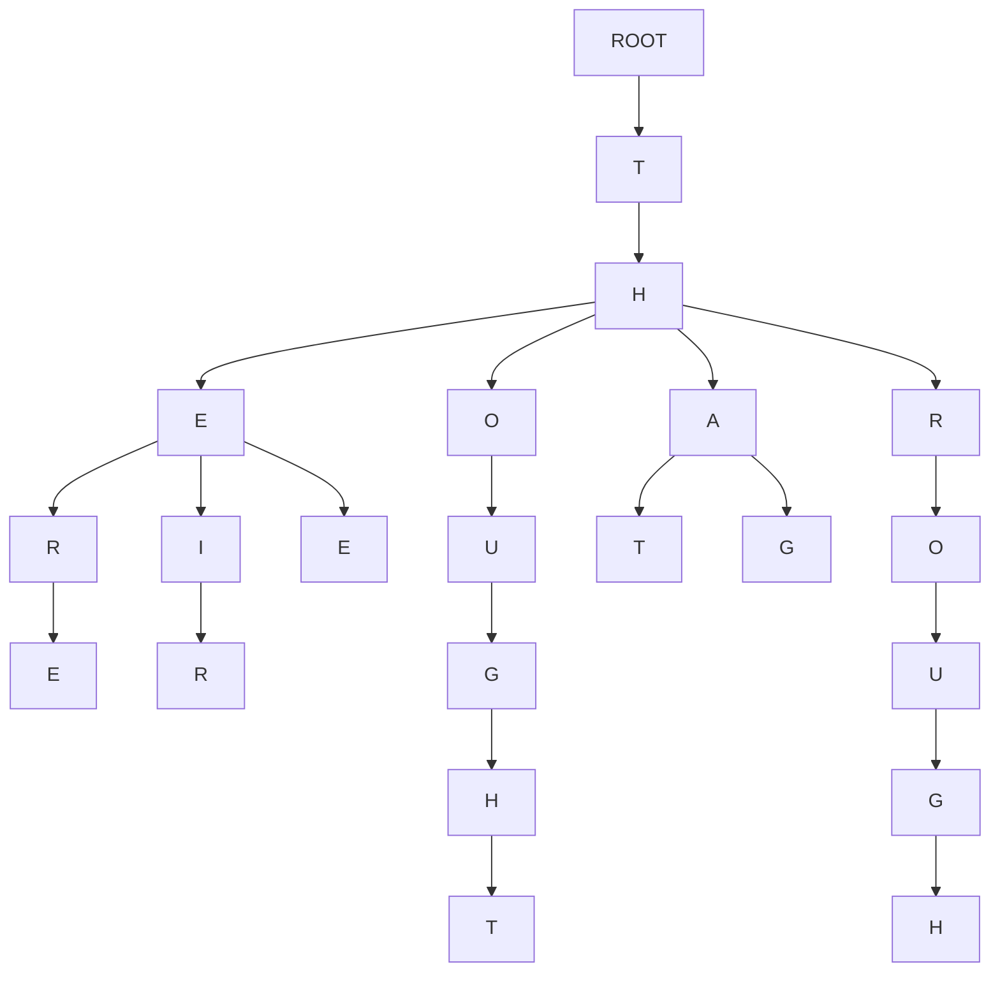

```txt
there though that the their through thee thou thought thag 
```



```mermaid
graph TD;
    ROOT-->T;
    T-->H
    
    H-->E3[E]
    H-->O3[O]
    H-->A3[A]
    H-->R3[R]

    E3-->R_there[R]
    R_there-->E_there[E]

    E3-->I_their[I]
    I_their-->R_their[R]

    E3-->E_thee[E]

    O3-->U4[U]
    U4-->G_thought[G]
    G_thought-->H_thought[H]
    H_thought-->T_thought[T]

    A3-->T_that[T]

    R3-->O_through[O]
    O_through-->U_through[U]
    U_through-->G_through[G]
    G_through-->H_through[H]

    A3-->G_thag[G]

```