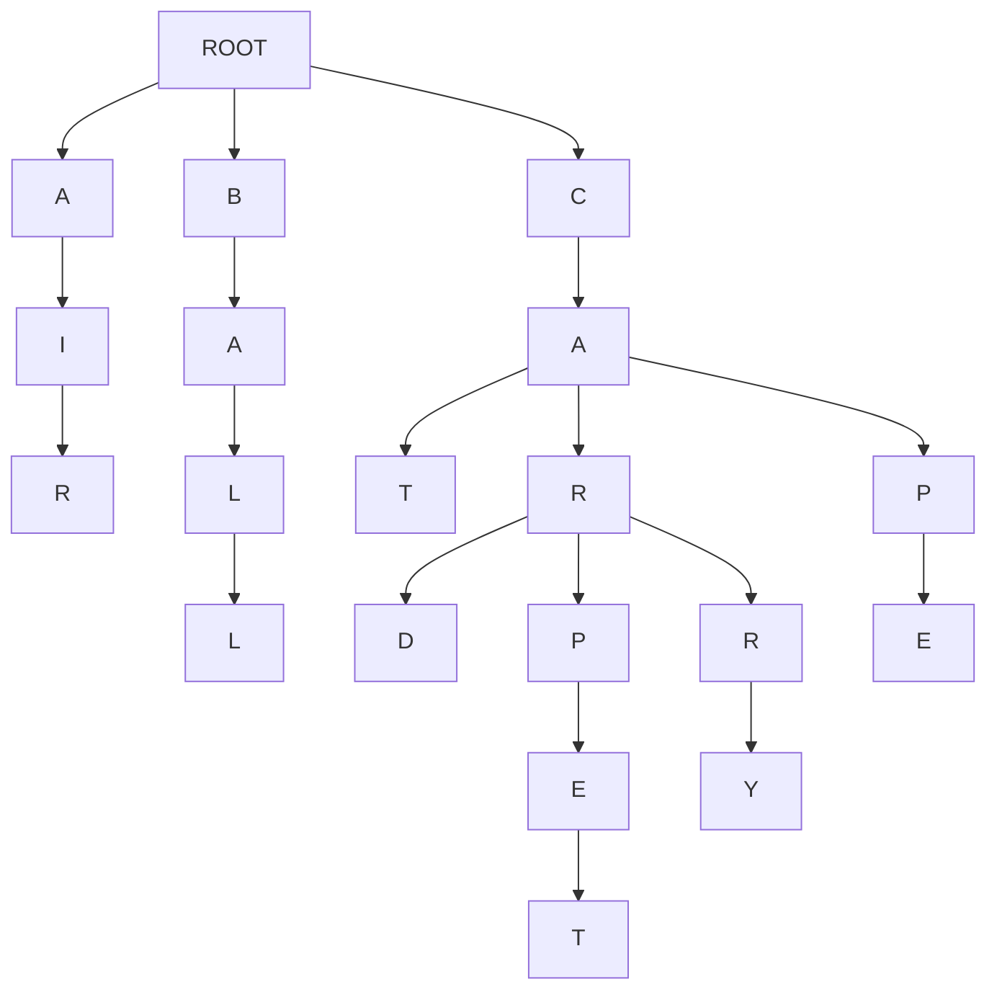

[](https://classroom.github.com/a/-fOB9vwA)
# Assignment 2 - SearchComplete

## Assignment Objectives

1) Learn how to implement search algorithms in python
2) Learn how search algorithms can be used in practical application
3) Learning the differences between BFS, DFS, and UCS via implementation
4) Analyze the differences between search algorithms by comparing outputs
5) Learning how to build a search tree from textual data
6) Build a basic autocomplete feature that suggests words as the user types, using different search strategies.
7) Analyze how each algorithm affects the order and quality of suggestions, and learn when to choose each one.

## Pre-Requisites

- **Basic Python:** Familiarity with Python syntax, data structures (lists, dictionaries, queues), and basic algorithms.
- **Search Algorithms:** Theoretical understanding of BFS, DFS, and UCS
- **Tree:** Prior knowledge of Tree data structures is helpful.
- **Data Structures:** High level understanding of Data Structures like Stacks, Queues, and Priority Queues is required.

## Overview
Imagine you're an intern at a cutting-edge tech company called "WordWizard." Your first task: upgrade their revolutionary messaging app, "ChatCast," to include a mind-blowing autocomplete feature. The goal is simple – as users type, the app magically suggests the words they might be looking for, making conversations faster and more fun!

But here's the twist: Your quirky, genius boss, Dr. Lexico, insists on using classic search algorithms to power this futuristic feature. "Forget fancy neural networks," she exclaims. "Let's prove that good old BFS, DFS, and UCS can still deliver the goods!"

So, you're handed a massive dictionary of Gen Z slang and challenged to build the autocomplete engine. Can you master the algorithms, construct a word-filled tree, and unleash the power of search to create an autocomplete experience that will make even the most texting-savvy teen say, "OMG, this is lit!"?

The future of "ChatCast" (and your internship) depends on it. Time to dive into the code and become a word-suggesting wizard! 

## Lab Description

1. **First step**
    - Clone the repo and run `main.py`
      ```bash
      python main.py
      ```
    - If you're on linux/mac and the former doesn't work for you
      ```bash
      python3 main.py
      ```
      
      
2.  **Explore the Starter Code:**
    - Review the provided `Autocomplete` class. It handles building the tree from a text document, setting up a basic user interface, and providing a framework for the `suggest` method.
3.  **Implement Search Algorithms:**
    - Your main task is to complete the `suggest` methods. These methods should take a prefix as input and return a list of word suggestions. 
    - You'll implement multiple versions of `suggest`:
        - `suggest_bfs`: Breadth-First Search
        - `suggest_dfs`: Depth-First Search
        - `suggest_ucs`: Uniform-Cost Search  


## Background: Autocomplete as a Search Problem

Alright! Let's give you some context before you get into the weeds of the starter code. 
Autocomplete might seem like some complicated magic, but at its core, it's just an application of search algorithms on a tree (that's how it's done in this assignment for your simplicity, but it's done very differently in real word). Let's break down how this works:

**The Search Space: A Tree of Characters**

To implement the autocomplete feature, you would build a tree of characters, which will be the search space for this search problem. 
In your starter code, you're given a `document` (a `txt` file) of several words. 
Imagine each word in your document is broken down into its individual letters. Now, picture these letters arranged in a single tree-like structure, for example look at the tree diagram below:


**Tree Diagram**

For example, let the document that is given to you be - 

```txt
air ball cat car card carpet carry cap cape
```




Above is a diagram of the tree that is build from the example `document` given above. Note how the *tree* starts with a common `root` 

- This is what the search space for your search problem would look like. 
- You will traverse the *tree* starting from the last node of the prefix that the user enters to generate autocomplete suggestions. 

**The Search Problem**

When a user types a prefix (e.g., "ca"), the autocomplete feature needs to find all the words in the *tree* that start with that prefix. This translates to a search problem:

- **Initial state:** The node representing the last letter of the prefix ("a" in our example).
- **Action** - a transition between one letter to the next letter in the *tree*
- **Goal:** The end of the word(s) (that start with the given prefix) in the *tree*. <u>Note how there could be multiple goals in this problem.</u>
- **Path:** The sequence of characters from the root to a goal node represents a complete word.

**Search Algorithms**

We can employ various search algorithms to traverse this *tree* and find our goal nodes (complete words).

- **Breadth-First Search (BFS):**  Explores the *tree* level-by-level, ensuring we find the shortest words first. 
- **Depth-First Search (DFS):** Dives deep into the *tree*, potentially finding longer, less common words first.
- **Uniform-Cost Search (UCS):** Considers the frequency of each character transition to prioritize more likely words based on the prefix.

**Multiple Goals and Paths**

In autocomplete, we're not just looking for a single goal node. We want to find *all* the goal nodes (words) that follow from the prefix. Furthermore, we're interested in the entire path from the root to each goal node, as this path represents the complete suggested word.

**Your Task:**

Your task is to implement BFS, DFS, and UCS to traverse the *tree* and generate autocomplete suggestions. You'll see how different algorithms affect the order and type of words suggested, and understand the trade-offs involved in choosing one over the other.


## Starter Code
For the starter code you have been given 3 files - 
1. **`autocomplete.py`** - This is where all your code that you write will go.
2. **`main.py`** - This file is responsible to setting up and running the autocomplete feature. Modifying this file is optional. Feel free to use this file for debugging or playing around with the autocomplete feature.
3. **`utilities.py`** - This file contains the code to read the document provided and building the Graphical User Interface for the autocomplete feature. This file is not related to the core logic of the autocomplete feature. Please do not modify this file.

### `autocomplete.py`
- This file has a `Node` class defined for you - 
    - Each Node represents a single character within a word. The `Node class has 1 attribute - 
        1. `children` - This is a dictionary that stores - 
            - Keys - Characters that which follow the current character in a word.
            - Values - `Node` objects, representing the next character in the sequence. 
    **You might (most likely will) want the `Node` class keep track of more things depending on how you implement you `suggest` methods.**

- The file also has an `autocomplete` class defined for you - 
    - The Engine Behind the Suggestions
    - **Attributes**
        - `root`: A root node of the tree. The tree stores all the words of the document in a tree structure, where each `Node` is character.
    - **Methods**
        - `__init__(document="")`:
            - Initializes an empty tree (the `root` node).
            - If a `document` string is provided, it builds the tree from that document.
            - document is a space separated textfile, example below.
            - ```txt
              air ball cat car card carpet carry cap cape
              ``` 
        - `build_tree(document)` #TODO:
            - As the name of the function suggests, takes a text string `document` and builds a tree of words, where each `Node` is a character. 
            - The implementationn of this method has been left up to you.

## **Student Tasks:**
The main goal of the lab activity is for students to implement the `build_tree`, `suggest_bfs`, `suggest_ucs`, and `suggest_dfs` methods. 


### 0. TODO: Intuition of the code written
- For all code that you will write for this assignment (which is not a lot), you must provide a breif intuition (1-2 sentences) of the major control structures of your code in the reports section at the bottom of this readme.
- You are not being asked to write a story, keep it concise and precise (remember, 1-2 sentences, at most 3).

**Consider the `fizz-buzz` code given below:**

```python
def fizzbuzz(n):
    for i in range(1, n + 1):
        if i % 15 == 0:
            print("FizzBuzz")
        elif i % 3 == 0:
            print("Fizz")
        elif i % 5 == 0:
            print("Buzz")
        else:
            print(i)

```

**Now this is what you're explaination should (somewhat) look like -**

<u>Iterates through a range of numbers n printing that number unless the number is a multiple of 3 or 5 where instead "Fizz" or "Buzz" is printed respectively. "FizzBuzz" is printed if the number is a multiple of both 3 and 5.</u>


### 1. TODO: `build_tree(document)`

>[!NOTE]
>**TODO: Draw the tree diagram of test.txt given in the starter code**
    - Upload the image into your `readme` into the reports section in the end of this readme.


**What it does:**

- Takes a text `document` as input.
- Splits the document into individual words.
- Inserts each word into a tree (prefix tree) data structure.
- Each character of a word becomes a node in the tree.

**Your task:**

- Complete the `for` loop within the `build_tree` method.


### 2. TODO: `suggest_bfs(prefix)`

**What it does:**

- Implements the Breadth-First Search (BFS) algorithm on the tree.
- Takes a `prefix` (the letters the user has typed so far) as input.
- Finds all words in the tree that start with the `prefix`.

**Your task:**
- Start from the node that corresponds to the last character of the `prefix`.
- Using BFS traverse the sub tree and build a list of suggestions.
- **Run your code with the `genZ.txt` file and `suggest_bfs()` method that you just implemented with the prefix `"th"` and note the the autocompleted suggestions it generates in the *Reports Section* below. Make sure you note down the suggestions in the same order in which they are originally displayed on your screen.**

### 3. TODO: `suggest_dfs(prefix)`

**What it does:**

- Implements the Depth-First Search (DFS) algorithm on the tree.
- Takes a `prefix` as input.
- Finds all words in the tree that start with the `prefix`.

**Your task:**
- Start from the node that corresponds to the last character of the `prefix`.
- Using DFS traverse the sub tree and build a list of suggestions.
- **Explain your intuition in recursive DFS VS stack-based DFS, and which one you used. Write this in the section provided at the end of this readme.**
- **Run your code with the `genZ.txt` file and `suggest_dfs()` method that you just implemented with the prefix `"th"` and note the the autocompleted suggestions it generates in the *Reports Section* below. Make sure you note down the suggestions in the same order in which they are originally displayed on your screen.**

### 4. TODO: `suggest_ucs(prefix)`

**What it does:**

- Implements the Uniform Cost Search (UCS) algorithm on the tree.
- Takes a `prefix` as input.
- Finds all words in the tree that start with the `prefix`.
- Prioritizes suggestions based on the frequency of characters appearing after previous characters.

**Your task:**

- Update `build_tree()` to store the path cost. The path cost is the inverse frequencies of that letter/char following that prefix of characters.
    - Using the inverse of these frequencies creates a lower path cost for more frequent character sequences.    
- Start from the node that corresponds to the last character of the `prefix`.
- Using UCS traverse the sub tree and build a list of suggestions.
- **Run your code with the `genZ.txt` file and `suggest_ucs()` method that you just implemented with the prefix `"th"` and note the the autocompleted suggestions it generates in the *Reports Section* below. Make sure you note down the suggestions in the same order in which they are originally displayed on your screen.**

<br>

>[!NOTE]
>This is not optional
> Try experimenting with different approaches and compare the results! Try typing different prefixes in the GUI and observe how the suggested words change depending on which search algorithm you're using. This will help you gain a deeper understanding of their strengths and weaknesses.<br>
> **Note down these observations in the reports section provided at the end of this readme**


## What to Submit

1.  **Completed `autocomplete.py` file:**  Containing your implementations of the `build_tree`, `suggest_bfs`, `suggest_dfs`, and `suggest_ucs` methods.
2.  **Completed _Reports Section_ at the botton of the `readme.md` file:** Briefly explaining wherever necessary, and completing the required tasks in the *Reports Section*. 

## Rubric

| Criteria                        | Points (Example) |
| -------------------------------- | ----------- |
| Diagram and explaination for `build_tree` | 10% |
| Correctness of `build_tree`      | 10%         |
| Explaination of `build_tree`      | 10%         |
| Correctness of `suggest_bfs`     | 10%         |
| Explaination of `suggest_bfs`     | 10%         |
| Correctness of `suggest_dfs`     | 10%         |
| Explaination of `suggest_dfs`     | 10%         |
| Correctness of `suggest_ucs`     | 10%         |
| Explaination of `suggest_ucs`     | 10%         |
| Experimention                     | 10 %        |

<hr>
<br>
<br>


# A Reports section
## Late Days
How many late days are you using for this assigmment? 0

## 383GPT
Did you use 383GPT at all for this assignment (yes/no)?

## `build_tree`

### Tree diagram
- Put the tree diagram for `test.txt` here


### Code analysis
- At first: this is my code for this part solely:
 ```python
     def build_tree(self, document):
        for word in document.split():
            node = self.root
            for char in word:
                #TODO for students
                if char not in node.children:
                    node.children[char] = Node()
                node = node.children[char]
            node.is_word = True
 ```
- intuition of my code:
Intuitively, each word must start from a common root. The line of code `node = self.root` ensures that this condition is met. Next, iterate through each character of the word and check for its presence in the next level or depth from the current node.
If a character is not found in the children of the current node, add that character to the children attribute of the current node by creating a new Node. The process continues, with the node moving down the tree , using the newly created Node as the new current node, until the loop reaches the end of the word. Finally, mark a found complete word using the line `code.is_word = True`. The main purpose of build_tree is to set up a tree from the document so that the BFS or DFS could run on it

## `BFS`

### Code analysis
This is my code:
``` python
def iterate_through_the_Tree(self,prefix,tempN):
        for c in prefix:
            if(c in tempN.children):
                tempN = tempN.children[c]
            else:
                return ""
        return tempN

    #TODO for students!!!
    def suggest_bfs(self, prefix):
        if(len(prefix) == 0):
            return []
        tempN = self.root
        result = []
        tempN = self.iterate_through_the_Tree(prefix,tempN)
        if(type(tempN) != Node):
            return "No suggestion"
        qWord_Level = deque()
        qWord_Level.append((prefix,tempN))
        while(qWord_Level):
            currCharacter, currPointerToThatCharacter  = qWord_Level.popleft()
            if(len(currPointerToThatCharacter.children.keys()) == 0 or currPointerToThatCharacter.is_word):
                result.append(currCharacter)
            for neighbor,PointerToTheNextNode in currPointerToThatCharacter.children.items():
                qWord_Level.append((currCharacter + neighbor, PointerToTheNextNode))
        return result
```
Explaination: 
First, if the prefix is empty, simply return an empty array. Otherwise, implement BFS to travese the tree. Since the intial state starts from the last letter of the prefix, use the helper function ` iterate_through_the_Tree`, which is also utilized in dfs and ucs to avoid code duplication, to locate to the node of last letter. The BFS employs a deque to manage nodes because the algorithm of BFS follows FIFO structure. Thus instead of using `pop()` like stack, BFS requires `popleft()` for queue. The mechanism is to continually popLeft the queue, push into the queue all combinations of the current node along with its neighbors `currCharacter + neighbor` as well as keep track the current level of the tree by `PointerToTheNextNode`, then travese down the tree. If a complete word found, add it into the result. In summary, the BFS explores all of the neighbors of the current node first before moving to the next level. 
### Your output


## `DFS`

### Code analysis
``` python
def iterate_through_the_Tree(self,prefix,tempN):
        for c in prefix:
            if(c in tempN.children):
                tempN = tempN.children[c]
            else:
                return ""
        return tempN
 def recursive_function_helper(self,tempN,result,prefix):
        if(len(tempN.children.keys()) == 0 or tempN.is_word):
            result.append(prefix)
        for neighbor, nextLevel in tempN.children.items():
            nextPrefix = prefix + neighbor
            self.recursive_function_helper(nextLevel,result,nextPrefix)

    def suggest_dfs(self, prefix):
        if(len(prefix) == 0):
            return []
        tempN = self.root
        result = []
        tempN = self.iterate_through_the_Tree(prefix,tempN)
        if(type(tempN) != Node):
            return "No suggestion"
        self.recursive_function_helper(tempN,result,prefix)
        return result
```

- Explaination: In a similar manner to BFS, check the prefix, return empty when it is necessary before proceeding the Dfs. Once the position of the last character of the prefix in the tree is located, call the recursive function (`recursive_function_helper`) with the root node set to the node of that last character. Continue traversing the tree by updating the next node level (`nextLevel`) and the sequence of letters formed so far (`nextPrefix`) to find complete words. If the current node is marked as `is_word`, add it to the final result. The idea of the DFS is to keep moving down the tree until reaching the last layer or last node of a branch. After that, backtrack the tree

### Your output


### Recursive DFS vs Stack-based DFS
I used recursive DFS because of its efficency and intuitiveness. Specifically, unlike the stack-based DFS, recursive DFS does not require manually keeping track of nodes and flow of characters. Plus, space complexity of stack_based DFS is higher than that of recursive DFS since it requires a stack. And after all, recursive DFS is simpler and easier to code. However, one advantage of stack-based DFS which is over recursive one is its flexibility. For example, switching between BFS and DFS can be done easily by changing popleft() to pop(). Also, using stack DFS can avoid overflow in case where the graph has very long depth

## `UCS`

### Code analysis
``` python
class Node:
    #TODO
    def __init__(self):
        self.children = {}
        self.is_word = False
        self.following_character_frequency_count = {}
        self.path_cost_corresponding_to_previous_characters = {}
class Autocomplete():
    def __init__(self, parent=None, document=""):
        self.root = Node()
        self.suggest = self.suggest_ucs

    def Caculate_inverse_for_each_following_character(self,node2):
        for neighbor, frequencies in node2.following_character_frequency_count.items():
            node2.path_cost_corresponding_to_previous_characters[neighbor] = 1/frequencies
            self.Caculate_inverse_for_each_following_character(node2.children[neighbor])

    def build_tree(self, document):
        for word in document.split():
            node = self.root
            for char in word:
                #TODO for students
                if char not in node.children:
                    node.children[char] = Node()
                if(char in node.following_character_frequency_count):
                    node.following_character_frequency_count[char] += 1
                else:
                    node.following_character_frequency_count[char] = 1
                node = node.children[char]
            node.is_word = True
        node2 = self.root
        self.Caculate_inverse_for_each_following_character(node2)

    def iterate_through_the_Tree(self,prefix,tempN):
        for c in prefix:
            if(c in tempN.children):
                tempN = tempN.children[c]
            else:
                return ""
        return tempN

    def suggest_ucs(self, prefix):
        if(len(prefix) == 0):
            return []
        tempN = self.root
        result = []
        tempN = self.iterate_through_the_Tree(prefix,tempN)
        intial_cost = 0
        tempHeapq = []
        if(type(tempN) != Node):
            return "No suggestion"
        tempHeapq.append((intial_cost,prefix,tempN))
        while(tempHeapq):
            path_cost_so_far, sequence_letter_so_far, current_level_node = heapq.heappop(tempHeapq)
            if(current_level_node.is_word):
                result.append(sequence_letter_so_far)
            for neighbors,next_level_node in current_level_node.children.items():
                next_cost = path_cost_so_far + current_level_node.path_cost_corresponding_to_previous_characters[neighbors]
                heapq.heappush(tempHeapq,(next_cost,sequence_letter_so_far + neighbors, next_level_node))
        return result
```

- Explaination:
  First of all, before setting up the path cost and calculating the inverse, 2 additional attributes needs to be added to the Node class: `following_character_frequency_count`, which counts the frequencies of each child of the current node, and `path_cost_corresponding_to_previous_characters` , which calculates the path cost based on the inverse of frequence. Then, modify the build_tree function based on the new update of the Node class so that the frequency of each child for which each character represents is increased by 1. Aftermath, the function `Caculate_inverse_for_each_following_character` invert all the frequencies so far by taking reciprocal (1/frequency). In the `suggest_ucs` function, similarly to bfs and dfs functions mentioned earlier, check the prefix, iterate through the tree until the location of the last prefix found. Next, using heapq to stores 3-tuples consisting of the current path cost -`path_cost_so_far`-, sequence of letter sofar-`sequence_letter_so_far`-, and the current depth level of the tree-`current_level_node`-. The heapq is for prioritizing suggestions because it organizes the 3-tuples according to path cost, and if two path costs are the same, it then compares the sequences of letters. Furthermore, the next_cost path is calculated by adding the path_cost sofar by the path_cost of the current node. 

### Your output


## Experimental
- The BFS orgranizes suggestions based on the ascending level or depth of the tree. For example, "thee", "thou", "that", "thag" are located at the level 5 of the tree, while "there","their" which end up at level 6. The BFS strenghs include: easy to read, manage, and predict. However, some uncommon words like "thag" are displayed first in the suggestions. Moreover, the words might not be displayed in the alphabetic order.
- The DFS organizes suggestions according to the completion of one branch before going to the next alternatives. Take this case as an example, "there", "their", "thee", the algorithm will finish exploring the branch for 'there' first, then backtrack to the node for 'e' and continue traversing through the branches for 'i' and 'e'. The advantage of DFS is requiring less space and time for finding the words. However, some uncommon and long words might be displayed before the useful ones.     
- UCS functions like a real dictionary search engine, prioritizing suggestions based on both frequency and alphabetical order. However, it takes more time than the BFS or DFS algorithms because UCS needs to organize the input and calculate the path costs
- One special case I have found so far is prefix "l":
  all three algorithms return the same suggestions

The reason for it is the words themselves.
- when I checked the input "th" with the file "recipes.txt", BFS ran very slowly to find valid words.


